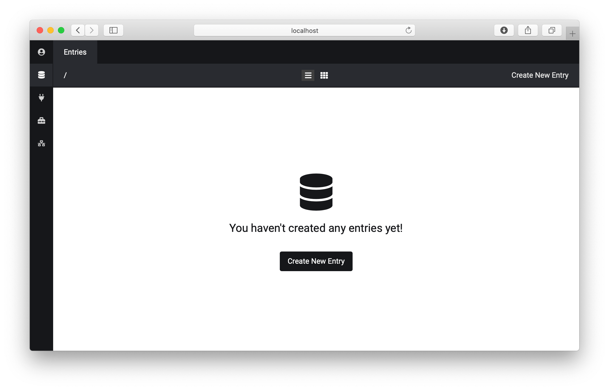

<h1 align="center">Admin Panel Plugin for <a href="http://flextype.org/">Flextype</a></h1>

     

<h1 align="center">Supporting Flextype</h1>

Flextype is an MIT-licensed open source project and completely free to use.

However, the amount of effort needed to maintain and develop new features for the project is not sustainable without proper financial backing. You can support it's ongoing development by being a backer or a sponsor:

- [Become a backer or sponsor on Patreon](https://www.patreon.com/awilum).
- [One-time donation via PayPal, QIWI, Sberbank, Yandex](http://flextype.org/en/one-time-donation)
- [Visit our Sponsors & Backers page](http://flextype.org/en/sponsors)

## Dependencies

The following dependencies need to be installed for Admin Panel Plugin.

### System

| Item | Version | Download |
|---|---|---|
| [flextype](https://github.com/flextype/flextype) | 0.9.7 | [download](https://github.com/flextype/flextype/releases/download/v0.9.7/flextype-0.9.7.zip) |

### Plugins

| Item | Version | Download |
|---|---|---|
| [twig](https://github.com/flextype-plugins/twig) | 1.0.0 | [download](https://github.com/flextype-plugins/twig/releases/download/v1.0.0/twig-1.0.0.zip) |
| [icon](https://github.com/flextype-plugins/icon) | 1.0.0 | [download](https://github.com/flextype-plugins/icon/releases/download/v1.0.0/icon-1.0.0.zip) |
| [form](https://github.com/flextype-plugins/form) | 1.0.0 | [download](https://github.com/flextype-plugins/form/releases/download/v1.0.0/form-1.0.0.zip) |
| [form-admin](https://github.com/flextype-plugins/form-admin) | 1.0.0 | [download](https://github.com/flextype-plugins/form-admin/releases/download/v1.0.0/form-admin-1.0.0.zip) |
| [jquery](https://github.com/flextype-plugins/jquery) | 1.0.0 | [download](https://github.com/flextype-plugins/jquery/releases/download/v1.0.0/jquery-1.0.0.zip) |

## LICENSE
[The MIT License (MIT)](https://github.com/flextype/flextype/blob/master/LICENSE.txt)
Copyright (c) 2018-2020 [Sergey Romanenko](https://github.com/Awilum)
