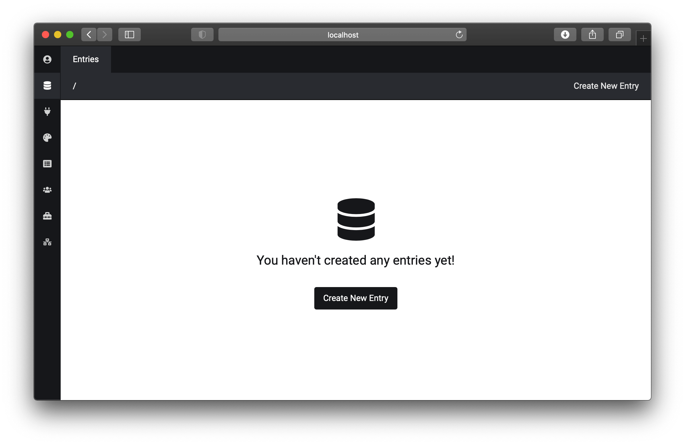

<h1 align="center">Admin Panel Plugin for <a href="http://flextype.org/">Flextype</a></h1>

      

## DEPENDENCIES

The following dependencies need to be installed for Admin Panel Plugin.

### System

| Item | Version | Download |
|---|---|---|
| [flextype](https://github.com/flextype/flextype) | 0.9.7 | [download](https://github.com/flextype/flextype/releases/download/v0.9.7/flextype-0.9.7.zip) |

### Plugins

| Item | Version | Download |
|---|---|---|
| [twig](https://github.com/flextype-plugins/twig) | 1.0.0 | [download](https://github.com/flextype-plugins/twig/releases/download/v1.0.0/twig-1.0.0.zip) |
| [icon](https://github.com/flextype-plugins/icon) | 1.0.0 | [download](https://github.com/flextype-plugins/icon/releases/download/v1.0.0/icon-1.0.0.zip) |
| [form](https://github.com/flextype-plugins/form) | 1.0.0 | [download](https://github.com/flextype-plugins/form/releases/download/v1.0.0/form-1.0.0.zip) |
| [form-admin](https://github.com/flextype-plugins/form-admin) | 1.0.0 | [download](https://github.com/flextype-plugins/form-admin/releases/download/v1.0.0/form-admin-1.0.0.zip) |
| [jquery](https://github.com/flextype-plugins/jquery) | 1.0.0 | [download](https://github.com/flextype-plugins/jquery/releases/download/v1.0.0/jquery-1.0.0.zip) |

## INSTALLATION

* Download & Install all required dependencies.
* Download Admin Panel Plugin and unzip plugin to the folder /site/plugins/
* Go to YOUR_SITE_URL/admin and create new user account.

## COMMUNITY
Flextype is open source, community driven project, and maintained by community!

- [Github](https://github.com/flextype)
- [Discord](https://flextype.org/en/discord)
- [Twitter](https://twitter.com/getflextype)
- [Vkontakte](https://vk.com/flextype)

## CONTRIBUTE
Flextype is an open source project and community contributions are essential to its growing and success. Contributing to the Flextype is easy and you can give as little or as much time as you want.

- Help on the [Communities.](http://flextype.org/en/community)
- Develop a new plugin.
- Create a new theme.
- Find and [report issues.](https://github.com/flextype/flextype/issues)
- Link back to [Flextype](http://flextype.org).
- [Donate to keep Flextype free.](http://flextype.org/en/sponsors)
- [Join Flextype International Translator Team](http://flextype.org/en/international-translator-team)

## LICENSE
[The MIT License (MIT)](https://github.com/flextype-plugins/admin/blob/master/LICENSE.txt)
Copyright (c) 2018-2020 [Sergey Romanenko](https://github.com/Awilum)
